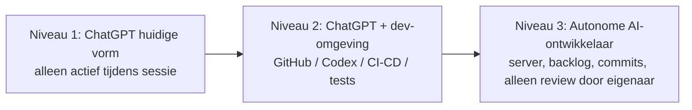
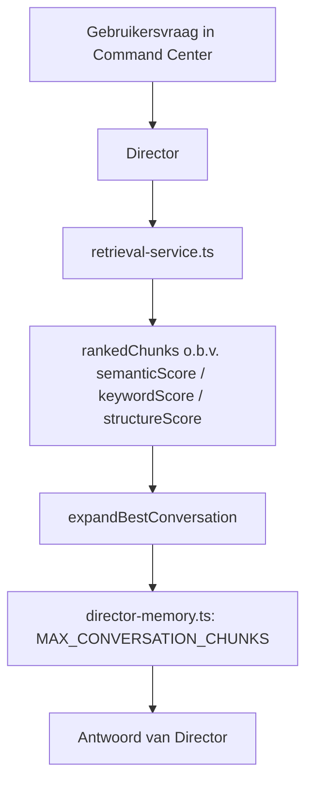

# 04-architecture.md — The Dost Matrix Kennisbibliotheek

Bron: the-dost-matrix-development-chat-01.md

---

# ARCH-0001

## Drie niveaus van AI-werkmodel voor ontwikkeling

1. **ChatGPT zoals nu** — goed voor ontwerpen, programmeren en problemen oplossen tijdens een actieve sessie, maar geen achtergrondwerker; stopt zodra de sessie stopt.
2. **ChatGPT gekoppeld aan een ontwikkelomgeving** (GitHub, Codex/CLI, CI/CD, tests, enz.) — kan binnen die omgeving veel meer doen en veel grotere taken in één keer uitvoeren.
3. **Een autonome AI-ontwikkelaar die op een server draait** — pakt taken uit een backlog, schrijft code, test, maakt commits; de eigenaar doet alleen nog reviews.



Toelichting: Claude Code is specifiek ingericht om codebases te lezen, bestanden te wijzigen en commando's uit te voeren. OpenAI heeft hiervoor Codex, dat lokaal of in een cloudomgeving repositories kan onderzoeken, bestanden aanpassen, tests draaien en wijzigingen laten beoordelen.

---

# ARCH-0002

## Second Brain: 1 brein met twee hersenhelften

De Second Brain-module moet ontworpen worden als één brein met twee hersenhelften, niet als twee aparte, losstaande breinen. Dit is een expliciete correctie op een eerdere ontwerprichting.

---

# ARCH-0003

## Interface-eenheid

Dashboard, chat+second brain en knowledge moeten samen vanuit 1 interface werken. Op het moment van bespreken stonden deze nog in aparte vensters binnen de localhost-omgeving.

---

# ARCH-0004

## Genoemde bestanden/modules in de codebase

| Bestand | Rol |
|---|---|
| `src/core/application/codebase/codebase-scanner.ts` | Scant de codebase; definieert `CodebaseFile` en `CodebaseSnapshot` types, met `EXCLUDED_DIRECTORIES` en `EXCLUDED_FILES` |
| `src/core/domain/knowledge/knowledge-entry.ts` | Domeinmodel voor knowledge-entries; bevat (o.a.) `KnowledgeReviewRecommendation`, `KnowledgeReview`, en `knowledgeEntry` (met ontbrekend veld `approvedAt`, zie BUG-0007) |
| `src/core/application/conversation/retrieval-service.ts` | Retrievallogica voor gearchiveerde conversatie-chunks; bevatte `addNeighbourChunks`, vervangen door `expandBestConversation` |
| `src/core/application/conversation/chunk-service.ts` | Bepaalt hoe conversaties in chunks worden opgesplitst bij archivering; bevat `CHUNK_LENGTH` en `CHUNK_OVERLAP` |
| `src/core/application/conversation/archive-service.ts` | Archiveringslogica; bepaalt via `shouldReprocessConversation` of een conversatie opnieuw verwerkt moet worden |
| `src/core/application/director/director-memory.ts` | Geheugenlogica van de Director; bevat `MAX_CONVERSATION_CHUNKS` |

---

# ARCH-0005

## Diagnostics / retrieval-datamodel (Command Center)

Bij een vraag aan Director/Command Center wordt een diagnostics-object teruggegeven met (voorbeeld uit de chat):

```
{
  ownerId: string,
  query: string,
  diagnostics: {
    knowledgeCount: number,
    conversationChunkCount: number,
    archiveContextLength: number,
    rankedChunks: [
      {
        chunkId: string,
        conversationId: string,
        filename: string,
        chunkIndex: number,
        score: number,
        semanticScore: number,
        keywordScore: number,
        structureScore: number,
        containsStepOne: boolean,
        containsStepTwo: boolean,
        containsStepThree: boolean,
        containsStepFour: boolean,
        contentPreview: string
      },
      ...
    ]
  }
}
```

Zie 05-code.md voor het volledige, letterlijke voorbeeld dat in de chat is geplakt (query: "Welke vier stappen heb ik op 28 juli expliciet voorgeschreven voor de verdere bouw van The Dost Matrix?", met `knowledgeCount: 12`, `conversationChunkCount: 3`, `archiveContextLength: 13701`).


